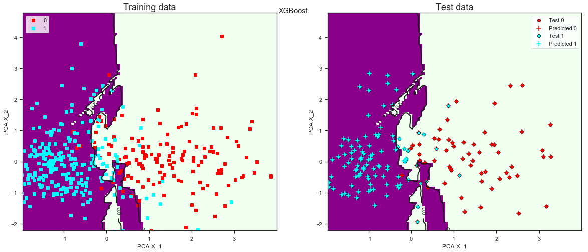
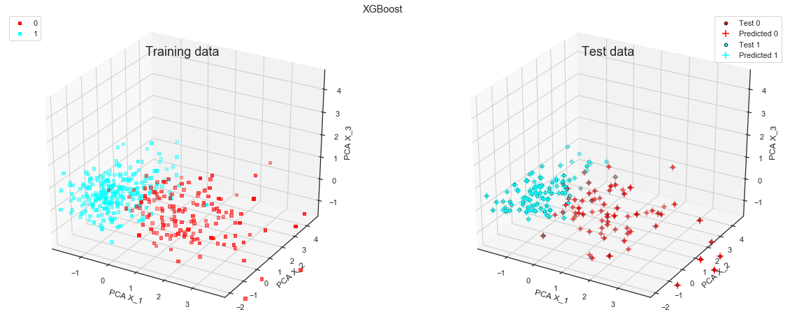

## UCI Breast Cancer Classification using scikit-learn and XGBoost
    
    *  Exploratory data analysis using pandas, seaborn plotting and 
       scikit-learn feature selection
    *  Data preprocessing including splitting, scaling and balancing 
       data (SMOTEENN, SVMSMOTE algorithms)
    *  Classification using Logistic Regression, Random Forest and 
	   XGBClassifier
    *  Hyperparameter tuning of XGBClassifier parameters using 
       RandomizedSearchCV of scikit-learn
    *  Plotting of the train, test and fit data
    -----
    *  The best training accuracy (~99.8%) comes from a XGBClassifier on 
       SVMSMOTE balanced data but with a test accuracy of only 90.6% indicating significant overfitting. 
    *  The best test accuracy (~95.0%) comes from Logistic Regression, 
	   RandomForestClassifier and XGBClassifier all fit on SMOTEENN balanced data. 
	   

-----

